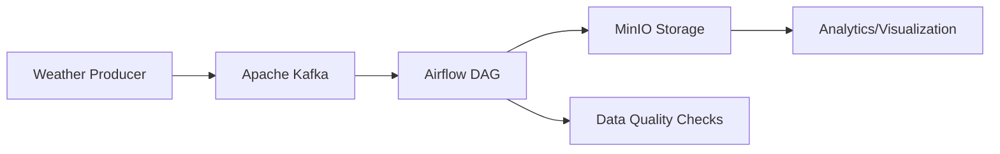

# 🌤️ Weather Data Pipeline with Kafka, Airflow & MinIO

A production-grade, scalable data engineering pipeline implementing the Medallion Architecture (Bronze-Silver-Gold) for real-time weather data processing. This system demonstrates modern data engineering best practices including event-driven architecture with Apache Kafka, object storage with MinIO (S3-compatible), cloud data warehousing with Snowflake, and orchestration using Apache Airflow. The pipeline handles synthetic weather data generation, streaming ingestion, batch processing, and multi-layer transformations using dbt.

## 🏗️ Architecture



### Components:
- **Weather Producer**: Python script generating synthetic weather data
- **Apache Kafka**: Distributed streaming platform for data ingestion
- **Airflow**: Orchestration and workflow management
- **MinIO**: S3-compatible object storage for data lake
- **PostgreSQL**: Metadata database for Airflow

## 🚀 Quick Start

### Prerequisites
- Docker & Docker Compose
- Python 3.8+
- 8GB+ RAM available

### 1. Clone the Repository
```bash
git clone https://github.com/yourusername/weather-data-pipeline.git
cd weather-data-pipeline
```

### 2. Start Infrastructure Services
```bash
# Start Kafka and MinIO
docker-compose -f docker-compose-kafka.yml up -d

# Start Airflow
docker-compose -f docker-compose-airflow.yml up -d
```

### 3. Set Up Environment
```bash
# Create Python virtual environment
python -m venv venv
source venv/bin/activate  # On Windows: venv\Scripts\activate

# Install dependencies
pip install -r requirements.txt
```

### 4. Generate Weather Data
```bash
# Start the weather data producer
python weather_producer.py
```

### 5. Access Services
- **Airflow UI**: http://localhost:8085 (admin/admin)
- **Kafka UI**: http://localhost:8080
- **MinIO Console**: http://localhost:9001 (admin/minio_admin_123)

## 📁 Project Structure

```
weather-data-pipeline/
├── dags/                    # Airflow DAG definitions
│   ├── weather_consumer.py
│   └── data_quality_check.py
├── scripts/                 # Utility scripts
├── docker-compose-airflow.yml
├── docker-compose-kafka.yml
├── Dockerfile              # Airflow custom image
├── weather_producer.py     # Kafka data producer
├── requirements.txt
└── README.md
```

## 🔧 Configuration

### Environment Variables
Create a `.env` file for custom configurations:

```env
# Kafka Configuration
KAFKA_CLUSTER_ID=MkU3OEVBNTcwNTJENDM2Qk
KAFKA_UI_CLUSTER_NAME=weather-cluster

# MinIO Configuration
MINIO_ROOT_USER=admin
MINIO_ROOT_PASSWORD=minio_admin_123

# PostgreSQL Configuration
POSTGRES_USER=airflow
POSTGRES_PASSWORD=airflow
POSTGRES_DB=airflow
```

### Kafka Topics
- `weather_v3`: Main topic for weather data streams
- Partitioned by city name for ordered processing

## 📊 Data Schema

Each weather event contains:
```json
{
  "city": "string",
  "temp": float,          // Temperature in Celsius
  "humidity": integer,    // Humidity percentage
  "condition": "string",  // Weather condition
  "local_time": "string", // ISO timestamp
  "wind_speed": float,    // Wind speed in km/h
  "pressure": integer     // Atmospheric pressure in hPa
}
```

## 🎯 Features

### Real-time Data Simulation
- Generates synthetic weather data for 10 major cities
- Configurable generation interval
- Random weather conditions with realistic ranges

### Stream Processing
- Kafka-based message queuing
- City-based partitioning for order guarantee
- Exactly-once delivery semantics

### Data Orchestration
- Airflow DAGs for batch processing
- Automated data quality checks
- Error handling and retry mechanisms

### Storage & Analytics
- MinIO for scalable object storage
- Parquet format for efficient querying
- Support for analytical workloads

## 🔍 Monitoring

### Kafka Monitoring
Access Kafka UI at `http://localhost:8080` to:
- Monitor topic partitions
- View consumer groups
- Inspect message streams
- Check broker health

### Airflow Monitoring
Access Airflow at `http://localhost:8085` to:
- Monitor DAG execution
- View task logs
- Manage workflow schedules
- Trigger manual runs

### MinIO Monitoring
Access MinIO Console at `http://localhost:9001` to:
- Monitor storage usage
- Manage buckets and objects
- Configure access policies

## 🧪 Data Quality

The pipeline includes automated data quality checks:
- Temperature range validation (-10°C to 45°C)
- Humidity percentage validation (5% to 95%)
- Timestamp format verification
- Missing field detection

## 🚦 Performance

### Scalability
- Horizontally scalable Kafka cluster
- Multi-worker Airflow configuration
- Partitioned data processing

### Throughput
- ~2000 messages/second (single producer)
- Adjustable batch sizes
- Configurable processing intervals

## 🔄 Workflow

1. **Data Generation**: Weather producer creates synthetic data
2. **Stream Ingestion**: Kafka receives and partitions data by city
3. **Batch Processing**: Airflow consumes in configurable intervals
4. **Quality Checks**: Automated validation of data integrity
5. **Storage**: Processed data stored in MinIO as Parquet files
6. **Monitoring**: All services provide health metrics and logs

## 🛠️ Development

### Adding New Cities
Edit the `CITIES` list in `weather_producer.py`:
```python
CITIES = ['Tehran', 'Istanbul', 'London', 'New York', 'Tokyo', 
          'Berlin', 'Paris', 'Dubai', 'Moscow', 'Toronto', 'Sydney']
```

### Custom Weather Conditions
Modify the `WEATHER_CONDITIONS` list:
```python
WEATHER_CONDITIONS = ['Sunny', 'Cloudy', 'Rainy', 'Snowy', 
                      'Foggy', 'Thunderstorm', 'Windy']
```

### Extending Data Schema
Update the `generate_weather_data` method:
```python
def generate_weather_data(self, city):
    return {
        # ... existing fields ...
        "new_field": value,
        "another_field": value
    }
```

## 🧹 Cleanup

Stop all services:
```bash
docker-compose -f docker-compose-airflow.yml down
docker-compose -f docker-compose-kafka.yml down
```

Remove volumes (warning: deletes all data):
```bash
docker volume prune
```

## 📈 Future Enhancements

1. **Machine Learning Integration**
   - Weather prediction models
   - Anomaly detection for extreme conditions

2. **Advanced Analytics**
   - Real-time dashboard with Grafana
   - Historical trend analysis
   - Comparative city analytics

3. **Scalability Improvements**
   - Kubernetes deployment
   - Multi-region Kafka clusters
   - Distributed Airflow executors

4. **Data Enrichment**
   - Integration with real weather APIs
   - Geographic data enrichment
   - Social media sentiment correlation

## 🤝 Contributing

1. Fork the repository
2. Create a feature branch (`git checkout -b feature/AmazingFeature`)
3. Commit changes (`git commit -m 'Add AmazingFeature'`)
4. Push to branch (`git push origin feature/AmazingFeature`)
5. Open a Pull Request

## 📄 License

This project is licensed under the MIT License - see the [LICENSE](LICENSE) file for details.

## 🙏 Acknowledgments

- [Apache Kafka](https://kafka.apache.org/)
- [Apache Airflow](https://airflow.apache.org/)
- [MinIO](https://min.io/)
- [Confluent](https://www.confluent.io/) for Kafka Docker images

## 📞 Support

For issues, questions, or suggestions:
1. Check existing [Issues](https://github.com/yourusername/weather-data-pipeline/issues)
2. Create a new issue with detailed description
3. Email: your.email@example.com

-